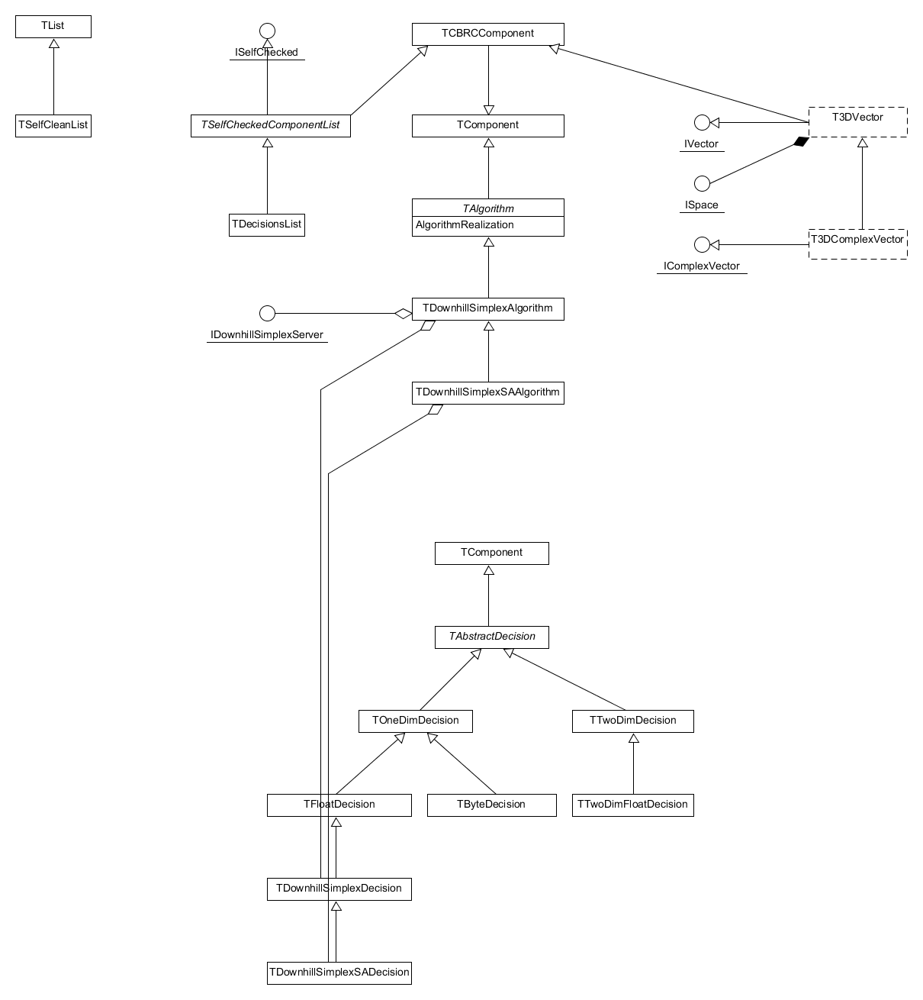

# fitminimizers
Downhill simplex algorithm including variant with simulated annealing for Delphi & Lazarus. 

This software is distributed under [Mozilla Public License 2.0](https://www.mozilla.org/en-US/MPL/2.0/), which allows you to use this component in commercial software.

The repository includes demo application which solves minimum bounding box problem.

## TDownhillSimplexAlgorithm
Classical implementation of downhill simplex algorithm.

## TDownhillSimplexSAAlgorithm
Downhill simplex algorithm with simulated annealing.

## Class diagram



These components are used in following projects  
[MotifMASTER](http://motifmaster.sourceforge.net/)  
[Fit](https://dvmorozov.github.io/fit/)  

## Building

Component should be built separately for Lazarus 0.9.24 (from branch [lazarus-0-9-24](https://github.com/dvmorozov/fitminimizers/tree/lazarus-0-9-24))
and for latest version of Lazarus (from branch [master](https://github.com/dvmorozov/fitminimizers/tree/master)).

*Notes for Lazarus 0.9.24 build*

If you see message like that *C:\lazarus-0.9.24\fpc\2.2.0\bin\i386-win32\windres.exe: can't open file 'TForm1': No such file or directory* make sure that *{$R *.dfm}* are excluded by compiler condition.


