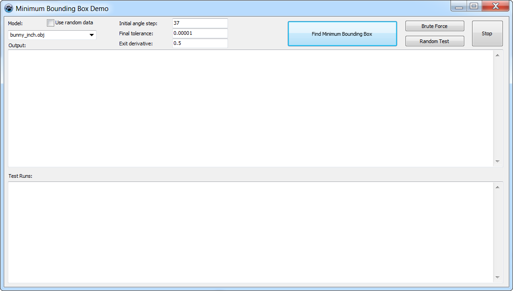
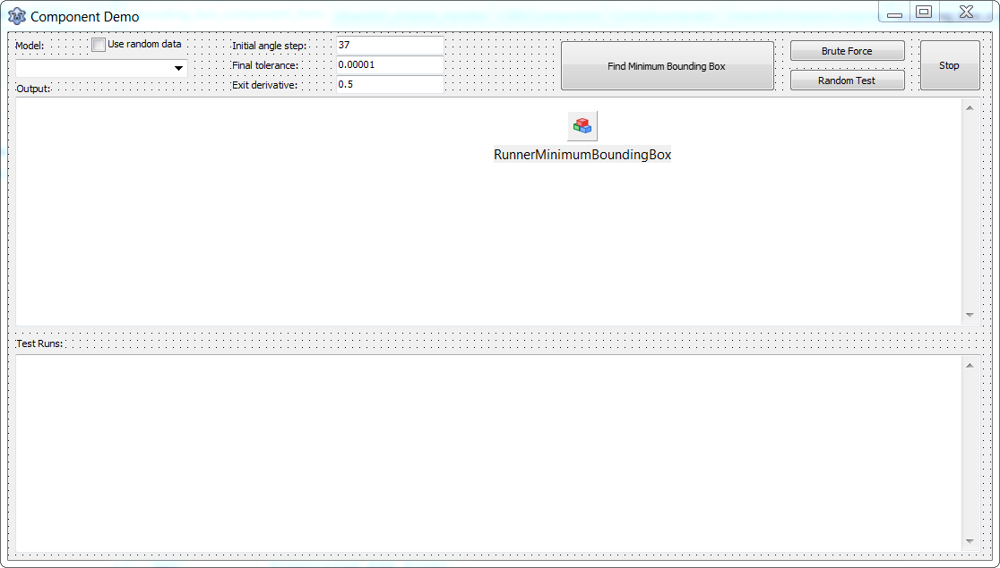

# fitminimizers
Downhill simplex algorithm including variant with simulated annealing for Delphi & Lazarus. 

This software is distributed under [Mozilla Public License 2.0](https://www.mozilla.org/en-US/MPL/2.0/), which allows you to use this component in commercial software.

## TDownhillSimplexAlgorithm
Classical implementation of downhill simplex algorithm.

## TDownhillSimplexSAAlgorithm
Downhill simplex algorithm with simulated annealing.

## Demo applications
The algorithm is abstracted from any particular task.
As an example of optimization task the "minimum bounding box" problem is used.
The goal is to find 3d box of minimum volume completely enclosing given set of points.

See
[Minimum bounding box](https://en.wikipedia.org/wiki/Minimum_bounding_box)
[Bounding volume](https://en.wikipedia.org/wiki/Bounding_volume)

Initially model data containing set of points are loaded into the program.
As parameters of optimization coordinate rotation angles are used. 
Angles are varied until minimum volume of the box enclosing given points will be found.

There are two variants of demo application having the same functionality. 
The first one uses interface to provide algorithm with data and compute goal function.
It also demostrates an approach to parallel optimization of independent tasks.

The second examples demonstrates using component on form to run optimization, which can
take significant time, in separate thread allowing interaction with application.

## Class diagram



These components are used in following projects  
[MotifMASTER](http://motifmaster.sourceforge.net/)  
[Fit](https://dvmorozov.github.io/fit/)  

## Building

Component should be built separately for Lazarus 0.9.24 (from branch [lazarus-0-9-24](https://github.com/dvmorozov/fitminimizers/tree/lazarus-0-9-24))
and for latest version of Lazarus (from branch [master](https://github.com/dvmorozov/fitminimizers/tree/master)).

*Notes for Lazarus 0.9.24 build*

If you see message like that *C:\lazarus-0.9.24\fpc\2.2.0\bin\i386-win32\windres.exe: can't open file 'TForm1': No such file or directory* make sure that *{$R *.dfm}* are excluded by compiler condition.


